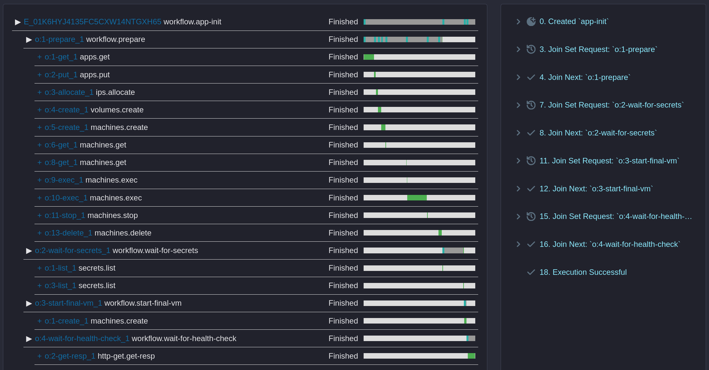
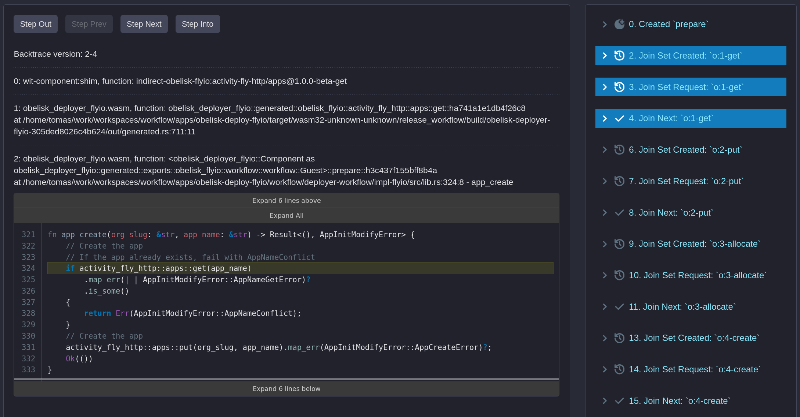

# Obelisk deployment app for Fly.io

An [Obelisk](https://obeli.sk) [workflow](workflow/deployer-workflow/impl-flyio/src/lib.rs)
that deploys an Obelisk app on Fly.io.

What it does:
* Creates a new Fly.io app
* Creates a VM with [MinIO](https://www.min.io) (for [litestream](https://litestream.io) testing)
* Creates a volume, populates it using a temporary VM
* Waits until the user submits application secrets
* Deploys the Obelisk app including
  * litestream replication to the MinIO VM
  * a simple health check endpoint
  * port forwarding to make the app's webhooks available
* Waits until the health check is successful

## Setting up
Set up environment variables based on [.envrc-example](.envrc-example).

Set up dependencies based on [dev-deps.txt](dev-deps.txt).

If `direnv` is available:
```sh
cp .envrc-example .envrc
$EDITOR .envrc # change FLY_APP_NAME and FLY_API_TOKEN
direnv allow
```

## Starting the server

Start Obelisk server
```sh
just build serve
# or `just serve-oci` without building the WASM components locally.
```

## Starting the workflow

### Deploying the deployment app itself

Run the [`app-init`](workflow/deployer-workflow/wit/obelisk-flyio_workflow@1.0.0-beta/workflow.wit) function:
```sh
just app-init "$(./scripts/json-app-init-itself.sh)"
```

While the workflow is running, push the secrets of your `.envrc` to the Fly.io app -
either using `fly` command, Fly.io's dashboard or using following [script](scripts/secrets-send.sh):

```sh
./scripts/secrets-send.sh .envrc FLY_API_TOKEN OBELISK__API__TOKEN
```

The following secret is required by the app:
* `FLY_API_TOKEN`

When all required secrets are present, the workflow will continue with creating the final VM and health checks.


Sample output:
```
E_01K6HYJ4135FC5CXW14NTGXH65
Locked
BlockedByJoinSet o:1-prepare
BlockedByJoinSet o:2-wait-for-secrets
BlockedByJoinSet o:3-start-final-vm
BlockedByJoinSet o:4-wait-for-health-check
Finished
Execution finished: OK: (no return value)

Execution took 58.933092209s.
```

The execution log can be inspected using the WebUI available at http://localhost:8080 .

<div>
  
  <div style="width:700px;"><em>Trace view</em></div>
</div>

<div>
  
  <div style="width:700px;"><em>Debug view</em></div>
</div>


After testing delete the app and its resources:
```sh
fly apps delete $FLY_APP_NAME
```

#### Inception - deploying the app one more time using the deployer on Fly.io

Pick a name for the inner app, we will call it `inception`.

Kill the local Obelisk server.

Proxy the gRPC port 5005 of the `obelisk` VM:
```sh
flyctl proxy 5005 $(fly machine list --json | jq -r '.[] | select(.name == "obelisk") | .private_ip')
```
To access the web console, proxy the port 8080 as well:
```sh
flyctl proxy 8080 $(fly machine list --json | jq -r '.[] | select(.name == "obelisk") | .private_ip')
```

Verify the port tunneling works:
```sh
obelisk component list
```

Now run `app-init` with a new fly app name:
```sh
NEW_APP_NAME="inception-$(date +%s)"

just app-init "$(FLY_APP_NAME=$NEW_APP_NAME ./scripts/json-app-init-itself.sh)"
```

Push the secret to the inner app:
```sh
FLY_APP_NAME=$NEW_APP_NAME ./scripts/secrets-send.sh .envrc FLY_API_TOKEN OBELISK__API__TOKEN
```


Don't forget to delete the inner and outer app afterwards.

### Stargazers
Similar to the process above, but deploying the [Stargazers Demo app](https://github.com/obeli-sk/demo-stargazers)
requires setting up secrets to various API providers, see the project's readme for details.

The follwing secrets are required by the app:
* `OPENAI_API_KEY`
* `GITHUB_TOKEN`
* `TURSO_TOKEN`
* `TURSO_LOCATION`
* `GITHUB_WEBHOOK_SECRET`

Run the [`app-init`](workflow/deployer-workflow/wit/obelisk-flyio_workflow@1.0.0-beta/workflow.wit) function:
```sh
just app-init "$(./scripts/json-app-init-stargazers.sh)"
```

Push the secrets using stargazers' `.envrc` file.
```sh
./scripts/secrets-send.sh ../stargazers/.envrc OPENAI_API_KEY GITHUB_TOKEN TURSO_TOKEN TURSO_LOCATION GITHUB_WEBHOOK_SECRET
```

# Testing Litestream backup and restore
Start the server:
```sh
just build serve
```
Submit the execution:
```sh
just start-restart-should-persist-state "$(./scripts/json-start-restart-should-persist-state-itself.sh)"
```
While the execution is running, push the `FLY_API_TOKEN` secret:
```sh
./scripts/secrets-send.sh .envrc FLY_API_TOKEN
```


# Using Fly.io activities directly

Check out the [components](https://github.com/obeli-sk/components) repo on how to interact with Fly.io APIs, including:
* Apps
* Volumes
* VMs
* Secrets
