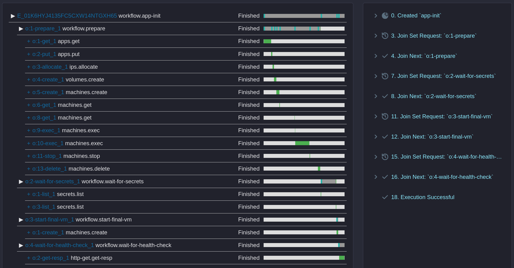

# Obelisk deployment tool - fly.io

An [Obelisk](https://obeli.sk) [workflow](workflow/deployer-workflow/impl-flyio/src/lib.rs)
that deploys the [Stargazers Demo app](https://github.com/obeli-sk/demo-stargazers) on fly.io.

## Usage
Set up environment variables based on [.envrc-example](.envrc-example).

Start Obelisk server
```sh
just build serve
# or just `obelisk server run -c obelisk-oci.toml` without building the WASM components locally.
```

Run the [`app-init`](workflow/deployer-workflow/wit/obelisk-flyio_workflow@1.0.0-beta/workflow.wit) function:
```sh
obelisk client execution submit -f obelisk-flyio:workflow/workflow@1.0.0-beta.app-init \
"$(./scripts/json-app-init-stargazers.sh)"
```

While the workflow is running, push the [stargazers](https://github.com/obeli-sk/demo-stargazers) secrets to the fly.io app -
either using `fly` command, fly.io's dashboard or using following [script](scripts/secrets-send.sh):

Point the script at stargazers' `.envrc` file.
```sh
./scripts/secrets-send.sh ../stargazers/.envrc
```

When all required secrets are present, the `app-init` workflow will continue with creating the final VM and health checks.

Sample output:
```
E_01K6HYJ4135FC5CXW14NTGXH65
Locked
BlockedByJoinSet o:1-prepare
BlockedByJoinSet o:2-wait-for-secrets
BlockedByJoinSet o:3-start-final-vm
BlockedByJoinSet o:4-wait-for-health-check
Finished
Execution finished: OK: (no return value)

Execution took 58.933092209s.
```

The execution log can be inspected using the WebUI available at http://localhost:8080 .

<div>
  
  <div style="width:700px; text-align:center;"><em>Trace view</em></div>
</div>

<div>
  
  <div style="width:700px; text-align:center;"><em>Debug view</em></div>
</div>


After testing delete the app and its resources:
```sh
fly apps delete $FLY_APP_NAME
```

## Using Fly.io activities directly

Check out the [components-flyio](https://github.com/obeli-sk/components-flyio) repo on how to interact with Fly.io, including:
* Apps
* Volumes
* VMs
* Secrets

Launch a VM:
```sh
export VOLUME_ID=..
MACHINE_ID=$(obelisk client execution submit -f --json obelisk-flyio:activity-fly-http/machines@1.0.0-beta.create -- \
\"$FLY_APP_NAME\" \"$FLY_MACHINE_NAME\" "$(./scripts/json-machine-create.sh)" \"$FLY_REGION\" \
| jq -r '.[-1].ok')
```

Execute a process:
```sh
obelisk client execution submit -f \
obelisk-flyio:activity-fly-http/machines@1.0.0-beta.exec \
-- \
\"$FLY_APP_NAME\" \
\"$MACHINE_ID\" \
'["obelisk", "server", "verify", "-c", "/volume/obelisk.toml"]'
```
